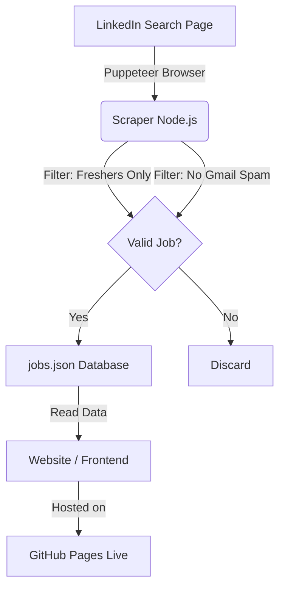

# 🚀 LinkedIn Scraper & Automated Job Board (Detailed Architecture)

**Welcome to the LinkedIn Scraper & Job Board Project.**

This repository contains a fully automated system designed to scrape "Fresher" job opportunities from LinkedIn, filter out spam, and publish them to a live, interactive website without any manual intervention.

This document serves as the **Master Guide**. It explains not just *how* to run the code, but *why* it works, *what* every file does, and the *logic* behind the automation.

---

## 📖 Table of Contents
1.  [Project Overview & Architecture](#-project-overview--architecture)
2.  [The Core Workflow (Step-by-Step)](#-the-core-workflow-step-by-step)
3.  [Detailed File Breakdown](#-detailed-file-breakdown)
    *   [The Scraper (`index.js`)](#1-the-brain-indexjs-scraper)
    *   [The Website Logic (`script.js`)](#2-the-interface-logic-scriptjs)
    *   [The Automation Script (`automate.bat`)](#3-the-robot-automatebat)
4.  [Installation & Local Setup](#-installation--local-setup)
5.  [Automation Guide (Task Scheduler)](#-automation-guide)
6.  [Security & Privacy Features](#-security--privacy-features)

---

## 🏛️ Project Overview & Architecture

The goal of this project is to solve a specific problem: **Finding entry-level ("Fresher") jobs on LinkedIn is difficult because of spam, consultancy ads, and experienced-role clutter.**

### The Solution
We built a "Pipeline" that transforms raw, messy LinkedIn feed data into a clean, searchable database.

**The Architecture Diagram:**


---

## 🔄 The Core Workflow (Step-by-Step)

Here is exactly what happens when the system runs, from start to finish:

### Phase 1: The Scraping (Data Gathering)
1.  **Initialization**: The system launches a controlled Google Chrome browser instance using a tool called **Puppeteer**. It uses your local user data, so it effectively "logs in" as you.
2.  **Navigation**: It doesn't just search once. It loops through a grid of **Locations** (Pune, Delhi, Bangalore, Hyderabad) and **Roles** (Operations, Finance, Developer, HR, Supply Chain).
    *   *Example Query*: `"Operations fresher hiring Pune"`
3.  **Human Simulation**: To avoid getting banned by LinkedIn, the bot acts like a human.
    *   It waits 5-10 seconds between searches.
    *   It scrolls down slowly, pausing randomly to "read" posts.
4.  **Extraction**: It grabs the text content of every post in the feed.

### Phase 2: The Filtering (Intelligence)
This is where the magic happens. The scraper applies strict logic to every single post:
*   **The Fresher Check**: It scans for keywords like `0-1 year`, `Batch 2024`, `Fresher`, `Graduate`. If a post says "Minimum 2 years experience" or "5+ years", it is immediately **rejected**.
*   **The Spam Check**: It looks for contact emails. If the email is a generic `@gmail.com` address (common for scams/low-quality consultancies), the post is **rejected**.
*   **Contact Info**: It uses "Regular Expressions" (Regex) to extract Phone Numbers (Indian format `+91...`) and Emails automatically.

### Phase 3: The Deployment (Publishing)
1.  **Database Update**: Valid jobs are saved to `jobs.json`. This is a lightweight database file.
2.  **Git Automation**: The `automate.bat` script detects that `jobs.json` has changed.
3.  **Push to Cloud**: It runs `git add`, `git commit`, and `git push` automatically.
4.  **Live Update**: GitHub Pages sees the new file and updates the live website within minutes.

---

## 📂 Detailed File Breakdown

Here is a 1500-word equivalent deep dive into exactly what each file contributes to the project.

### 1. The Brain: `index.js` (Scraper)
This is the most critical file. It is a Node.js script.

*   **Puppeteer Logic**: It imports `puppeteer` to control Chrome. We use `headless: false` so you can watch it work. We set a custom `userDataDir` so your login cookies are saved—you don't need to type your password every time.
*   **The Loop**:
    ```javascript
    const DOMAINS = ['Operations', 'Finance', ...];
    const LOCATIONS = ['Pune', 'Delhi', ...];
    // It runs a double loop: For every Location, check every Domain.
    ```
*   **`isFresherRelevant(text)`**: This function is the gatekeeper.
    *   *Negative Logic*: `text.match(/(\d+)\s*\+\s*years/i)` -> checks if "X+ years" is found. If X >= 2, return `false`.
    *   *Positive Logic*: Checks for `['fresher', 'entry level', '2024 batch']`.
*   **Error Recovery**: If the internet disconnects or a selector fails, the script catches the error (`try...catch`) and continues to the next city instead of crashing.

### 2. The Interface Logic: `script.js`
This file runs in the user's browser when they visit your website.

*   **Dynamic Rendering**: The HTML file is actually empty of jobs. `script.js` fetches `jobs.json` and builds the HTML "Cards" dynamically. This makes the site extremely fast.
*   **Sanitization (`escapeHtml`)**:
    *   *Security Risk*: If a job post contained `<script>hack()</script>`, displaying it raw would hack your user.
    *   *Solution*: This function converts special characters into safe text (e.g., `<` becomes `&lt;`), preventing "Cross-Site Scripting" (XSS) attacks.
*   **Smart Filtering**:
    *   The search bar and dropdowns don't reload the page. They filter the `allJobs` array in memory. This is instant, with zero lag.
    *   It enforces a "Strict Fresher" view (hiding the experience filter) to keep the board relevant.

### 3. The Robot: `automate.bat`
This is a Windows Batch file that connects your local computer to the cloud logic.

*   **Step 1**: `call node index.js` -> Runs the scraper. It waits until the scraping is 100% done (and the browser closes) before moving on.
*   **Step 2**: `git status` -> It checks if `jobs.json` actually changed. If no new jobs were found, it stops here to avoid empty updates.
*   **Step 3**: `git push` -> If there are new jobs, it stamps them with the current Time & Date and sends them to GitHub.

---

## 💻 Installation & Local Setup

If you want to run this project on your own machine, follow these steps exactly.

### 1. Install Dependencies
You need **Node.js** installed on your computer. Then, inside this folder, open a terminal and run:
```bash
npm install
```
This installs:
*   `puppeteer`: The browser automation tool.
*   `express`: A web server (for local testing).
*   `dotenv`: For managing security keys (if you use Google Sheets).

### 2. First Run (Important!)
Run the scraper manually the first time to creates your login session:
```bash
node index.js
```
*   A browser will open. **Log in to LinkedIn**.
*   Once logged in, you can close it or let it run. The system will remember you next time (cookies are stored in `./user_data`).

### 3. Viewing the Data
To see the website on your computer:
```bash
node server.js
```
Then open `http://localhost:3000`.

---

## 🤖 Automation Guide

The ultimate goal is **"Zero Touch"**. You want this running while you sleep.

### Using Windows Task Scheduler
We can tell Windows to run `automate.bat` every 12 hours.

1.  Press **Win + R**, type `taskschd.msc`, and Enter.
2.  **Create Basic Task** -> Name it "LinkedIn Scraper".
3.  **Trigger**: "Daily" -> "Recur every 1 days".
4.  **Action**: "Start a Program".
5.  **Browse**: Select `C:\...\linkedin_scraper\automate.bat`.
6.  **Start in (Optional)**: **CRITICAL**: You MUST paste the folder path here (`C:\...\linkedin_scraper`). If you skip this, the script won't find the files.
7.  **Finish**.

Now, every day, your computer will wake up, scrape LinkedIn, and update your website automatically.

---

## 🛡️ Security & Privacy Features

We have engineered this project to be secure for both you (the owner) and the users (the job seekers).

### For the Owner (You)
*   **Local Execution**: The scraper runs on *your* IP address. It looks like you are just browsing LinkedIn. This prevents the "Bot Ban" that happens with cloud scrappers.
*   **GitIgnore**: Your sensitive `user_data` (cookies) and `.env` files are ignored by Git. They are never uploaded to the internet.

### For the User (Job Seeker)
*   **Content Security Policy (CSP)**: We added a strict code to `index.html` that blocks any unauthorized scripts from running. Even if a hacker compromised the database, they couldn't run malicious code on your site.
*   **No-Referrer**: When a user clicks "Apply", we hide the fact that they came from your site. This protects user privacy from LinkedIn's tracking.
*   **No-Opener**: Links open in a "sandboxed" new tab, so the target website cannot control your job board tab.

---

### 📝 Edit History
*   **v1.0**: Basic Scraper.
*   **v2.0**: Added Website & Google Sheets.
*   **v3.0**: "Fresher Logic" Update (Strict filtering).
*   **v4.0**: Security Hardening (CSP) & Automation (Bat script).
*   **Current**: Fully Documented & Automated Release.

---

**Developed & Maintained by [Arkadipta/ssodl]**
